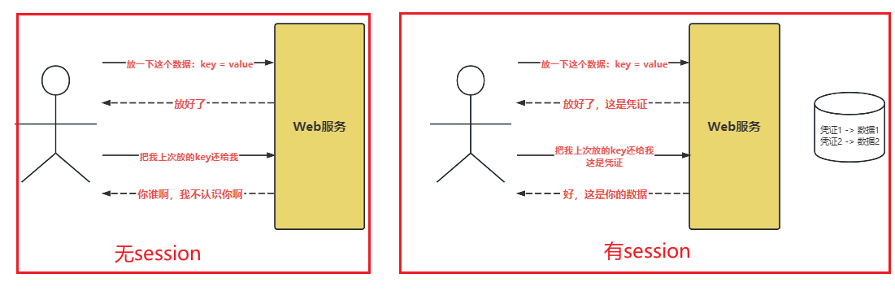
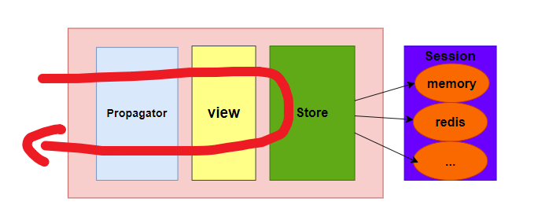

### session概述

由于HTTP协议是无状态的。即每一个HTTP请求都是独立的，可以请求之间没有任何关系

但在实际的业务中，我们经常需要将某些请求归并为一个组。最直观的例子就是登录状态，
一些资源只有登录之后参可以访问，所以一个HTTP请求过来，就要带上登录后的身份标识。

进一步说，在登陆之后，除了身份标识，还需要临时存放一些和用户相关的数据

这些东西就被称为`Session`，会话。


### session载体

所以session的核心就是让用户在HTTP请求里卖弄带上这种凭证，这个凭证也叫做session id

我们前面说过，输入可能来自HTTP协议的各个部分，那么session id也可以放在这些位置

- Cookie: 这是最常见的方法
- Request Header：部分情况下，当用户禁用了Cookie，可以考虑放在请求头中
- Request URL：在URL后面附上一个参数
- Request Body：理论上也可以放，但是很少

### 接口抽象


从上图中可以`Propagator`、`Session`、`Store`三者之间的关系

1. `Propagator`：主要是决定怎么提取session和怎么保存session到响应体中
2. `Session`：主要是决定session是保存在什么位置，memory还是redis中
3. `Store`：主要是提供接口，向前对接developer，向后对接Session

```go
package session

// Propagator 决定session的保存和提取
type Propagator interface {
	// Inject 往哪注入session
	Inject(ctx *geek_web.Context) error

	// Extract 从哪提取出session信息
	Extract(request *http.Request) (string, error)

	// Remove 从Response中移除session
	Remove(response *http.ResponseWriter) error
}

// Session 具体决定session的存储位置
// 表现为对session的存取
// 可能有些朋友可能对ID、key、value之间是什么关系？
// {
// 	ID1: {
// 		key: value
// 	},
// 	ID2: {
// 		key: value
// 	},
// 	ID3: {
// 		key: value
// 	},
// }
// 整个map就是一个store，每个ID就是一个session，每个session中其实可以存储多个数据信息。这个其实是根据具体的实现来定的。
type Session interface {
	// Get 获取Store中key所对应的value
	Get(ctx context.Context, key string) (string, error)
	// Set 设置Store中设置一个键值对，键是key，值是value
	Set(ctx context.Context, key string, value string) error
	// ID 获取当前session的唯一标识
	ID() string
}

// Store 管理所有的session
// 向前对接developer，向后对接Session
type Store interface {
	// Generate 创建一个session对象
	Generate(ctx context.Context, id string) (Session, error)
	// Refresh 刷新session对象
	Refresh(ctx context.Context, id string) error
	// Remove 删除session对象
	Remove(ctx context.Context, id string) error
	// Retrieve 获取session对象
	Retrieve(ctx context.Context, id string) (Session, error)
}

```

### Session存储位置

这个存储位置不是我们之前聊的那个存储位置，而是说我们从前端请求中解析出的session，应该存在哪里供后续的
中间件或者说用户视图使用。这才是我们着part要聊的内容。

这个问题的本质就是：怎么处理中间件间的通信问题.

这个问题其实挺常见的，不论是存session还是存其他别的信息。我们这里仿造Gin的解决方案。Gin其实是在Context
上下文中嵌入了一个map类型，专门是存储信息供中间件使用的。但是有点特殊，Gin给这个map还加上了一把读写锁，
防止数据不一致。对于这把锁的思考，我已经在源码中写明了，这里就不再赘述了。

吐槽一下Gin对于这个的设计

```go
// Set is used to store a new key/value pair exclusively for this context.
// It also lazy initializes  c.Keys if it was not used previously.
func (c *Context) Set(key string, value any) {
...
}

// Get returns the value for the given key, ie: (value, true).
// If the value does not exist it returns (nil, false)
func (c *Context) Get(key string) (value any, exists bool) {
...
}

// MustGet returns the value for the given key if it exists, otherwise it panics.
func (c *Context) MustGet(key string) any {
...
}

// GetString returns the value associated with the key as a string.
func (c *Context) GetString(key string) (s string) {
...
}

// GetBool returns the value associated with the key as a boolean.
func (c *Context) GetBool(key string) (b bool) {
...
}

// GetInt returns the value associated with the key as an integer.
func (c *Context) GetInt(key string) (i int) {
...
}

// GetInt64 returns the value associated with the key as an integer.
func (c *Context) GetInt64(key string) (i64 int64) {
...
}

// GetUint returns the value associated with the key as an unsigned integer.
func (c *Context) GetUint(key string) (ui uint) {
...
}

// GetUint64 returns the value associated with the key as an unsigned integer.
func (c *Context) GetUint64(key string) (ui64 uint64) {
...
}

// GetFloat64 returns the value associated with the key as a float64.
func (c *Context) GetFloat64(key string) (f64 float64) {
...
}

// GetTime returns the value associated with the key as time.
func (c *Context) GetTime(key string) (t time.Time) {
...
}

// GetDuration returns the value associated with the key as a duration.
func (c *Context) GetDuration(key string) (d time.Duration) {
...
}

// GetStringSlice returns the value associated with the key as a slice of strings.
func (c *Context) GetStringSlice(key string) (ss []string) {
...
}

// GetStringMap returns the value associated with the key as a map of interfaces.
func (c *Context) GetStringMap(key string) (sm map[string]any) {
...
}

// GetStringMapString returns the value associated with the key as a map of strings.
func (c *Context) GetStringMapString(key string) (sms map[string]string) {
...
}

// GetStringMapStringSlice returns the value associated with the key as a map to a slice of strings.
func (c *Context) GetStringMapStringSlice(key string) (smss map[string][]string) {
...
}

```

上述是Gin对Keys的具体操作，其实完全没有必要在封装这么多方法，这里说的方法是类型转换的那些

对于developer来说当然是好事，减少了他们的类型转换的麻烦

但是对于builder来说，这类功能其实是挺鸡肋的，因为操作起来并不麻烦，就可以直接推给developer。

吐槽归吐槽，但咱们也还是支持一下😅😅😅

咱们其实啥也没做，完全可以从Gin代码中Copy过来就能用，具体的方法啥都不用改😂😂😂。

具体的方法功能其实看方法签名就能知道，我就没有做具体的注释，但是需要额外注意的就是🔔`MustGet`方法，它如果没有获取到数据，会直接panic的